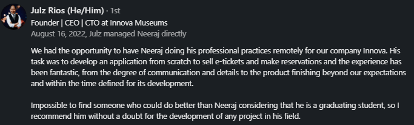
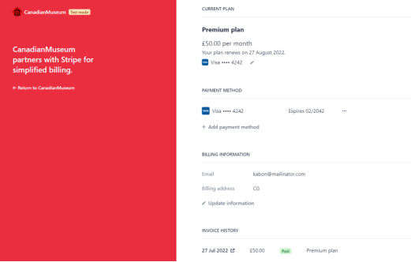
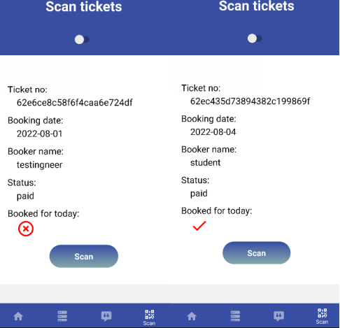
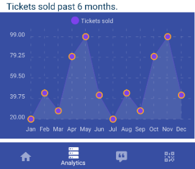
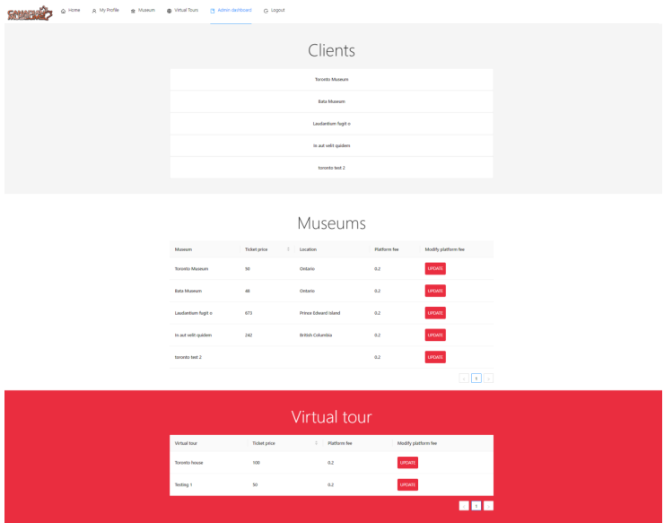
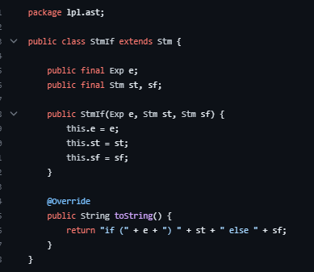

aws - contains thousands of lines of notes on topics ranging from cli, sdk, iam, ec2, serverless using api gateway, lambda, dynamodb, rds, route53, s3, vpc, etc.

innova: 
website
mobile

membership, museum, app, buy, order, platform fee

java lpl

car project

arduino
 
hangman game - network socket
https://github.com/rai-n/Networks/blob/master/IRC-Hangman/README.md

web scraping - selenium
https://github.com/rai-n/Web-Scraping-Indeed

game
https://github.com/rai-n/2D-physicsbased-game

utp
https://github.com/rai-n/utp  - get download documentation button for this for design and implementaiton    

ai predicting salaries
https://github.com/Malyrion/Intro-to-AI-CW/blob/master/Intro_to_AI_CW.ipynb